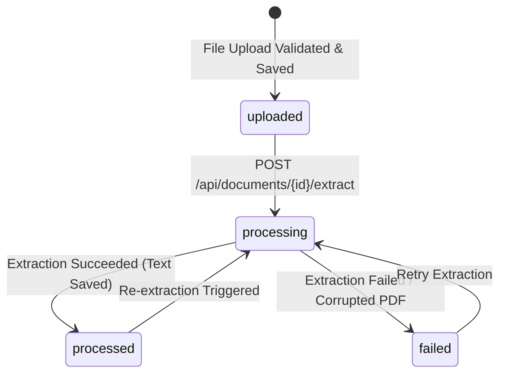

# DocuMind AI

> *Turn documents into answers.*

DocuMind AI is an intelligent document processing and question-answering platform designed to extract information and deliver precise answers from complex documents.

---

## 📌 Project Status

**Current Phase:** Phase 3 - PDF Text Extraction Engine

The document ingestion and text extraction pipeline is implemented using PyMuPDF to extract, clean, and persist document text page-by-page in SQLite.

### ✅ Implemented Features:
- **PDF Upload & Validation:** Enforces `.pdf` extension, MIME validation, file size limits (`MAX_UPLOAD_SIZE_MB`), and `%PDF-` binary signature check.
- **Safe & Collision-Resistant Storage:** Portable relative storage paths (`storage/documents/<uuid>.pdf`) with physical resolution from configured `STORAGE_DIR`.
- **SQLite Document Persistence:** Database records for document metadata and extracted text using SQLAlchemy 2.x.
- **Page-by-Page PDF Text Extraction:** Dedicated `PDFExtractionService` powered by PyMuPDF extracting text strictly in document page order.
- **Text Cleaning & Normalization:** Normalizes non-breaking spaces, zero-width characters, line breaks, and whitespace while preserving Unicode and multi-language content.
- **Status Lifecycle Management:** Tracks document state through `uploaded` ➔ `processing` ➔ `processed` (or `failed` on corrupted files).
- **Graceful Edge Case Handling:**
  - *Image-only / scanned PDFs:* Marked as `processed` with `extracted_text = null` (no false claims of OCR).
  - *Corrupted PDFs:* Returns structured `DOCUMENT_EXTRACTION_FAILED` error (HTTP 400) and marks status `failed`.
  - *Deterministic Re-extraction:* Safe re-extraction without data corruption.
- **Service Health Monitoring:** `GET /health` service endpoint.
- **Automated Test Suite:** 23 pytest test cases covering foundation, upload security, and extraction behaviors.

### ⏳ Planned (Future Milestones):
- **OCR Engine:** Tesseract OCR for scanned / image-only documents.
- **AI / LLM Integration:** Embeddings, vector indexing, document summarization, and interactive Q&A.
- **Frontend:** Modern Web UI (HTML/CSS/JavaScript).

> [!NOTE]
> **Important:** OCR (Optical Character Recognition) and AI/LLM summarization/Q&A are not implemented in Phase 3 and are planned for subsequent milestones.

---

## 🛠️ Technology Stack

- **Language:** Python 3.12+ (tested with Python 3.13)
- **Framework:** [FastAPI](https://fastapi.tiangolo.com/)
- **ASGI Server:** [Uvicorn](https://www.uvicorn.org/)
- **PDF Engine:** [PyMuPDF](https://pymupdf.readthedocs.io/)
- **ORM / Database:** [SQLAlchemy 2.x](https://www.sqlalchemy.org/) with SQLite
- **Validation & Settings:** [Pydantic v2](https://docs.pydantic.dev/) & [pydantic-settings](https://docs.pydantic.dev/latest/concepts/pydantic_settings/)
- **Testing:** [pytest](https://docs.pytest.org/) & [HTTPX](https://www.python-httpx.org/)

---

## 📁 Project Structure

```
documind-ai/
│
├── app/
│   ├── __init__.py
│   ├── main.py                  # FastAPI application entrypoint & exception handlers
│   │
│   ├── api/                     # API routing and endpoint handlers
│   │   ├── __init__.py
│   │   └── routes/
│   │       ├── __init__.py      # Router aggregator
│   │       ├── health.py        # Health check endpoint (/health)
│   │       └── documents.py     # Document & extraction endpoints (/api/documents)
│   │
│   ├── core/                    # Core configuration and infrastructure
│   │   ├── __init__.py
│   │   ├── config.py            # Pydantic Settings & environment config
│   │   ├── database.py          # SQLAlchemy engine, session & init_db
│   │   ├── exceptions.py        # Centralized application exception classes
│   │   └── logging.py           # Standard centralized logging
│   │
│   ├── models/                  # SQLAlchemy ORM models
│   │   ├── __init__.py
│   │   └── document.py          # Document database model
│   │
│   ├── schemas/                 # Pydantic validation schemas
│   │   ├── __init__.py
│   │   └── document.py          # Document response schemas
│   │
│   ├── services/                # Business logic layer
│   │   ├── __init__.py
│   │   ├── document_service.py  # Document upload, storage & lifecycle logic
│   │   └── pdf_extraction_service.py # PyMuPDF text extraction engine
│   │
│   └── repositories/            # Data access layer
│       ├── __init__.py
│       └── document_repository.py # Document CRUD operations
│
├── tests/                       # Automated test suite
│   ├── __init__.py
│   ├── conftest.py              # Pytest fixtures for isolated db & storage
│   ├── test_health.py           # Health check endpoint tests
│   ├── test_documents.py        # Document upload, validation & management tests
│   └── test_pdf_extraction.py   # PDF text extraction & edge cases tests
│
├── storage/                     # Storage for document files
│   ├── .gitkeep
│   └── documents/               # Stored uploaded PDF files
│       └── .gitkeep
│
├── data/                        # Local SQLite database directory (.gitkeep)
│   └── .gitkeep
│
├── docs/                        # Project documentation (.gitkeep)
│   └── .gitkeep
│
├── .env.example                 # Example environment variables template
├── .gitignore                   # Git ignore patterns
├── requirements.txt             # Python dependencies (includes PyMuPDF)
├── README.md                    # Project documentation
└── LICENSE                      # MIT License
```

---

## 🔌 API Endpoints

| Method | Endpoint | Description | Status Code |
| :--- | :--- | :--- | :--- |
| `GET` | `/health` | Service health status | `200 OK` |
| `POST` | `/api/documents/upload` | Upload & validate a PDF file | `201 Created` |
| `GET` | `/api/documents` | List uploaded documents with pagination (`?skip=0&limit=20`) | `200 OK` |
| `GET` | `/api/documents/{document_id}` | Retrieve document metadata & extracted text | `200 OK` |
| `POST` | `/api/documents/{document_id}/extract` | Trigger PDF text extraction via PyMuPDF | `200 OK` |
| `DELETE` | `/api/documents/{document_id}` | Delete document record and stored file | `200 OK` |
| `GET` | `/docs` | Interactive Swagger API documentation | `200 OK` |

---

## 🔄 Document Status Lifecycle



---

## 🚀 Getting Started

### 1. Prerequisites
- Python 3.12 or newer installed on your system.
- Git installed.

### 2. Set Up Virtual Environment

**Windows (PowerShell):**
```powershell
python -m venv .venv
.\.venv\Scripts\Activate.ps1
```

**Linux / macOS:**
```bash
python3 -m venv .venv
source .venv/bin/activate
```

### 3. Install Dependencies

```bash
pip install -r requirements.txt
```

### 4. Configure Environment

Copy the `.env.example` template:

```bash
# Windows
copy .env.example .env

# Linux / macOS
cp .env.example .env
```

### 5. Run the Application

Start the local development server with Uvicorn:

```bash
uvicorn app.main:app --reload --host 127.0.0.1 --port 8000
```

- Interactive API Docs (Swagger UI): `http://127.0.0.1:8000/docs`
- Health Check: `http://127.0.0.1:8000/health`

### 6. Run Automated Tests

Execute the full test suite using `pytest`:

```bash
pytest -v
```

---

## 🔒 Security Note

- **Path Traversal Protection:** Uploaded files are stored with unique UUID filenames and never use client-provided filenames on the local filesystem.
- **Magic Bytes Validation:** Uploaded PDFs are validated for the `%PDF-` signature to prevent executable or script files masquerading as PDFs.
- **Zero Secrets in Git:** Sensitive credentials and local databases (`*.db`, `*.sqlite`) are ignored by `.gitignore`.

---

## 📄 License

This project is licensed under the MIT License - see the [LICENSE](LICENSE) file for details.
